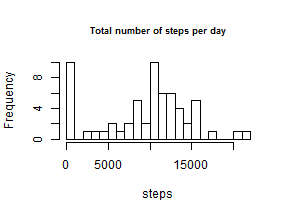
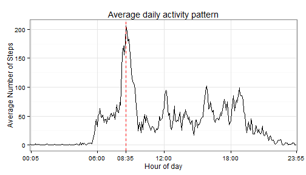
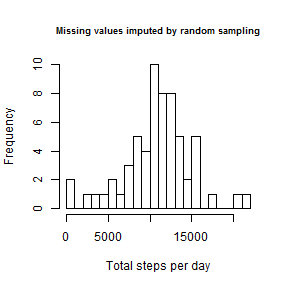
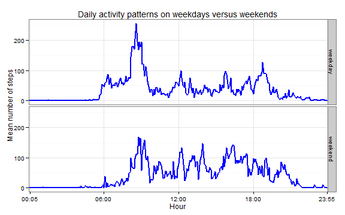

Reproducible Research Programming Assignment I
================================================================================


### About the data

Data from a personal activity monitoring device were collected at 5 minute 
intervals throughout the day. These data consist of the number of steps taken 
during 5 minute intervals each day in October and November 2012 and were collected from
an anonymous individual.

### Loading and preprocessing the data

This codes assumes that the "activity" file has been downloaded and is available
as a csv file in the working directory.

First, the data are read into an R object. The date column is changed into a 
date format and an hour column is created to show the 5-minute intervals in
terms of time of day.


```r
activity <- read.csv("activity.csv", stringsAsFactors = FALSE)
activity$date <- as.Date(activity$date)
hour <- mapply(function(x, y) paste0(rep(x, y), collapse = ""), 0, 
    4 - nchar(activity$interval))
hour <- paste0(hour, activity$interval)
hour <- format(strptime(hour, format = "%H%M"), format = "%H:%M")
activity$hour <- hour
rm(hour)
```

### What is mean total number of steps taken per day (ignoring missing values)?

The data are first summarized by summing the total per day.


```r
require(plyr)
dayActivity <- ddply(activity, c("date"), summarise, 
    totalSteps = sum(steps, na.rm = TRUE))
```

A histogram of the total number of steps taken per day is given here.


```r
hist(dayActivity$totalSteps, main = "Total number of steps per day",
    xlab = "steps", breaks = 20, cex.main = 0.75)
```

 


```r
dayMean <- round(mean(dayActivity$totalSteps),2)
dayMed <- median(dayActivity$totalSteps)
```

The **mean** number of steps per day was 9354.23.  
The **median** number of steps per day was 10395.


### What is the average daily activity pattern?

First, the data are summarised for each 5-minute interval, 
    averaging across all days.


```r
intervalActivity <- ddply(activity, c("interval", "hour"), summarise, 
    aveSteps = mean(steps, na.rm = TRUE))
```

A time-series plot of the average number of steps taken per 5-minute interval
is shown here.


```r
ggplot(intervalActivity, aes(x = hour, y = aveSteps)) +
    geom_line(aes(group = 1)) +
    theme_bw() + 
    scale_x_discrete(breaks = c("00:05", "06:00", "08:35", "12:00", "18:00", "23:55")) +
    xlab("Hour of day") +
    ylab("Average Number of Steps") +
    ggtitle("Average daily activity pattern") +
    geom_vline(x = which(Interval == 0835), linetype = "dashed", color = "red", size = .5)
```

 


```r
intervalMax <- intervalActivity$hour[which(intervalActivity$aveSteps ==
    max(intervalActivity$aveSteps))]
```

The 5-minute interval with the maximum number of steps, averaged across all days,
was the interval ending at 08:35.


### Impute missing values


```r
stepsMissing <- sum(is.na(activity$steps))
daysMissing <- length(unique(activity$date[is.na(activity$steps)]))
allDays <- length(unique(activity$date))
```

There were 2304 5-minute intervals which were missing values for the
number of steps taken. These data were missing from 8 of the 
61 days in the collection period. During those 8 days, 
no data were collected from any interval.

Missing values were imputed with a random sample from the non-missing values in the 
given 5-minute interval. This is a simple and imperfect imputation method, but oh well.


```r
set.seed(1353)
imputedActivity <- activity
Interval <- unique(activity$interval)
for(i in seq_along(Interval)) {
    replaceValues <- sample(activity$steps[!is.na(activity$steps) & 
        activity$interval == Interval[i]], 8) 
    imputedActivity$steps[is.na(imputedActivity$steps) & 
        imputedActivity$interval == Interval[i]] <- replaceValues
}
```

After imputing missing values, I recalculated the mean and median of steps per day.


```r
require(plyr)
imputedDaily <- ddply(imputedActivity, c("date"), summarise, 
    totalSteps = sum(steps))
imputeMean <- round(mean(imputedDaily$totalSteps), 2)
imputeMedian <- median(imputedDaily$totalSteps)
```

A histogram of the dataset including imputed values is plotted below.


```r
hist(imputedDaily$totalSteps, breaks = 20, xlab = "Total steps per day",
    main = "Missing values imputed by random sampling", cex.main = .75)
```

 

Imputing values for the missing days results in a distribution that is less
skewed to the right. The new mean and median are larger than for the raw data.
 The new mean is now 10803.9 rather than 9354.23. The new median
is 11015 steps rather than 10395 steps.

There is a difference in means of 1449.67 steps, and a
difference in medians of 620 steps.


### Are there differences in activity patterns between weekdays and weekends?

A variable was added to the dataset to indicate whether the activity took place
on a weekday or a weekend. The mean number of steps per interval is then 
calculated separately for weekends and weekends.


```r
imputedActivity$weekday <- weekdays(imputedActivity$date)
imputedActivity$day <- "weekday"
imputedActivity$day[imputedActivity$weekday %in% c("Saturday", "Sunday")] <-
    "weekend"
weekdayActivity <- ddply(imputedActivity, c("day", "interval", "hour"), summarise,
    meanSteps = mean(steps))
```

A visual representation of the mean number of steps per 5-minute interval is given
in the graph below. The steps are plotted against the hour, rather than the 
numeric interval.


```r
require(ggplot2)
ggplot(weekdayActivity, aes(x = hour, y = meanSteps)) +
    geom_line(aes(group = 1), color = "blue", size = 1) +
    scale_x_discrete(breaks = c("00:05", "06:00", "12:00", "18:00", "23:55")) +
    facet_grid(day ~ .) +
    theme_bw() +
    ggtitle("Daily activity patterns on weekdays versus weekends") +
    xlab("Hour") + ylab("Mean number of steps")
```

 

Activity appears to begin later in the day and to continue later in the evening on weekends.
The highest mean number of steps on weekdays was higher than on weekends.
